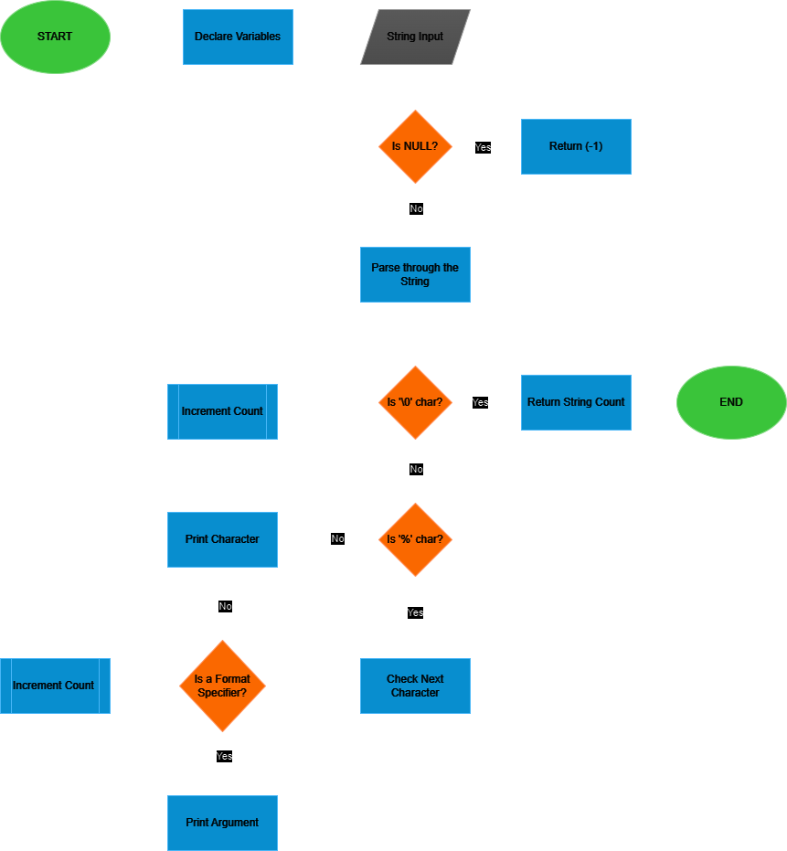

<div align="center">
<a href="https://www.holbertonschool.fr">

</a>
</div>

# **The _printf Project**

``The _printf project`` is part of the foundational curriculum at ``Holberton School``. It aims to develop students' skills in C programming by creating a custom implementation of the ``printf`` function from the C standard library. 

This project enhances understanding of format specifiers, variable arguments, and memory management, essential for future programming challenges.

- [**The \_printf Project**](#the-_printf-project)
- [Function Prototype](#function-prototype)
- [Compilation command](#compilation-command)
- [Requirements](#requirements)
- [Usage Examples](#usage-examples)
- [Man Page](#man-page)
- [Testing](#testing)
- [Flowchart](#flowchart)
- [Authors](#authors)

# Function Prototype

This is the prototype of the ``_printf`` function.

```c
int _printf(const char *format, ...);
```

- ``int`` : This return type indicates that the function returns an integer. This integer represents the number of characters printed. If an error occurs during printing, the function should return a negative value.
  
- ``const char *format`` : This parameter is a string that contains the format of the text to be displayed. It may include format specifiers (such as %s, %d, %c, etc.) that indicate how additional arguments should be formatted and displayed.
  
- ``...`` : The ellipsis (...) indicates that the function can accept a variable number of arguments. This allows ``_printf`` to be flexible and handle different types of data based on the format specifiers provided in the format string.

This prototype should be included in your header file.

# Compilation command

The following command compiles all *.c files in the current directory and generates an executable named ``_printf``, which includes the implementation of the ``_printf`` function.

```c
gcc -Wall -Werror -Wextra -pedantic -std=gnu89 -Wno-format *.c
```

# Requirements

- Allowed editors: 'vi', 'vim', 'emacs'
- All files will be compiled on Ubuntu 20.04 LTS using 'gcc'
- A GitHub account is required for contributing to the project or accessing the repository
- All files must end with a new line
- A 'README.md' file at the root of the project directory is mandatory
- Code must follow the Betty style guidelines
- Global variables are not allowed
- No more than 5 functions per file
- All function prototypes must be included in the header file named 'main.h'
- Don't forget to push your header file
- All header files must be include guarded
- The project should be compatible with 'gcc' using the flags '-Wall -Werror -Wextra -pedantic -std=gnu89'

# Usage Examples

The following examples demonstrate how to use the custom ``_printf`` function in your code.

These examples showcase basic string formatting, integer printing, and character output.

- Printing a formatted string with a %s placeholder

```c
#include "main.h"

int main(void)
{
	_printf("Hello, %s!\n", "world");
	return (0);
}
```
```c
Hello, world
user@holbertonstudents:~$
```

- Outputting an integer using the %d format specifier
```c
#include "main.h"

int main(void)
{
	_printf("Number: %d\n", 74);
	return (0);
}
```
``` c
Number: 74
user@holbertonstudents:~$
```
- Displaying a single character with the %c format specifier
```c
#include "main.h"

int main(void)
{
	_printf("Character: %c\n", 'A');
	return (0);
}
```
```c
Character: A
user@holbertonstudents:~$
```
# Man Page

```
_PRINTF                 Custom Library Manual                 

NAME
       _printf - custom implementation of the printf function,
	   			formats and displays data to standard output.

SYNOPSIS
       #include "main.h"

       int _printf(const char *format, ...);

DESCRIPTION
       The _printf() function produces output according to the format string that is
       specified. The format string can contain ordinary characters (which are copied
       unchanged to the output stream) and conversion specifications (which are
       replaced by the values of the additional arguments).

       The following conversion specifiers are supported:

       %d or %i
              Signed decimal integer.

       %s
              String of characters.

       %c
              Character.

       %%
              A literal percent sign.

       The arguments are converted according to the format specified. If there are not
       enough arguments for the format specifiers, the behavior is undefined.

RETURN VALUE
       The _printf() function returns the total number of characters written, excluding
       the null byte used to end output to strings. If an output error occurs, a negative
       value is returned.

ERRORS
       If an invalid conversion specifier is encountered or if an insufficient number of
       arguments are provided for the format string, an error occurs.

EXAMPLES
       #include "main.h"

       int main() {
           _printf("Hello, %s!\n", "world");  // Output: Hello, world!
           _printf("Number: %d\n", 74);        // Output: Number: 74
           return 0;
       }

COLOPHON
       This manual page documents the _printf function as part of a custom library.
```


# Testing


# Flowchart

<div align="center">


</div>

Made with [``draw.io``](http://draw.io/)

# Authors

Noor Medjahed [``@ni-mdj``](https://www.github.com/ni-mdj)

Benjamin Ristord  [``@jbn179``](https://www.github.com/jbn179)
 